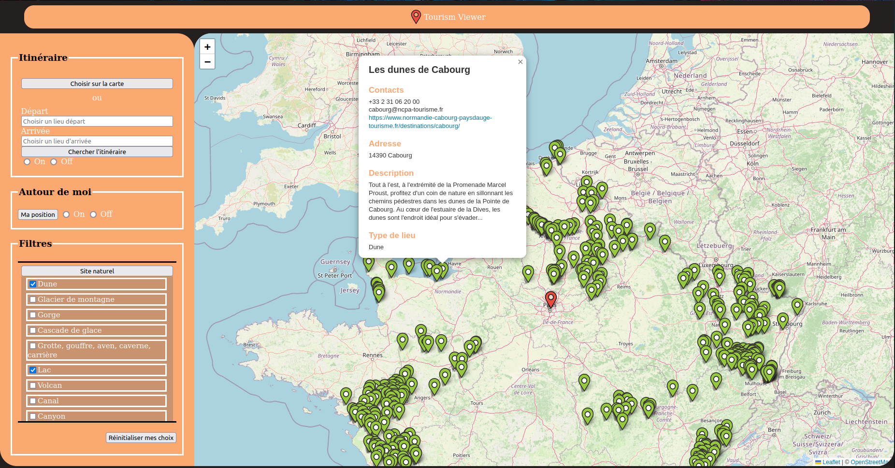

# Tourism Viewer - Site web touristique interactif

Projet de 3ème année - Licence Informatique

---

Tourism Viewer est un site web qui permet de visualiser des lieux touristiques dans toute la France sur une carte interactive.

## Aperçu

## Installation

**OS :** Linux , Mac OS , Windows 

**Librairies :**
- python 3
    `pip install python`
    *Attention* :  si python n'est pas détecté faire  :
    `sudo apt install python-is-python3`

- flask
    `pip install flask`

- mysql-server
    `sudo apt install mysql-server`

- pandas
    `pip install pandas`

- pathlib 
    `pip install pathlib`

- os 
    `pip install os-sys`

## Compilation

L'application web est gérée par Flask (le fichier app.py)
--- Lancer Le script app.py , copier l'URL affichée dans le navigateur ET  Bienvenus Dans notre Service Web ---

## À propos de l'utilisation

- **Les itinéraires** : deux modes de sélections sont possibles.
Soit le bouton enclenche le début de sélection pour le choix sur carte.
Soit deux barres de texte sont proposées pour taper le départ et à l'arrivée. La confirmation du choix demande une validation par l'utilisateur.
Dans les deux cas le départ et l'arrivée apparaissent en bleu sur la carte
L'itinéraire peut être caché quand inutilisé grâce aux boutons on off associés.
- **Les filtres** : rangés par catégories
L'affichage complet des types de lieux disponibles apparaît lorsque les boutons de la section filtre sont cliqués. Chaque checkbox cochée apparaît directement sur la carte.
Un bouton de réinitialisation des filtres est apposé au bas du panneau de sélection.
- **La position**
L'utilisateur peut demander à voir sa localisation en enclenchant le bouton "ma position".
Elle apparaît en rouge sur la carte. Si la position de l'utilisateur est connue il peut choisir ou non de ne faire apparaître que les lieux filtrés et autour de lui avec les boutons on off dédiés.
- **Les points d'intérêts**
Ils s'affichent sur la carte sous formes de pins verts. Toutes les informations relatives au lieu
en question apparaissent lorsque l'un d'entre eux est sélectionné.

## Crédits
### Encadrant   : - [CASABET Remy ](http://cazabetremy.fr/)
### Développeuses

- [RATOANDROMANANA Miella p2108878](https://forge.univ-lyon1.fr/p2108878)
- [HANITRINIRINA Sarobidy p2102840](https://forge.univ-lyon1.fr/p2102840)
- [NABET Ibtissam p2208660](https://forge.univ-lyon1.fr/p2208660)
- [PAULUS Noëllie p2100318](https://forge.univ-lyon1.fr/p2100318)

### Librairie utilisée pour la carte :
- [Leaflet](https://leafletjs.com/)
- [Pandas](https://pandas.pydata.org/)
- [pathlib](https://docs.python.org/3/library/pathlib.html)
- [os](https://docs.python.org/3/library/os.html)
- [Jqueryui] (https://jqueryui.com/)
- [Jquery] (https://jquery.com/)

